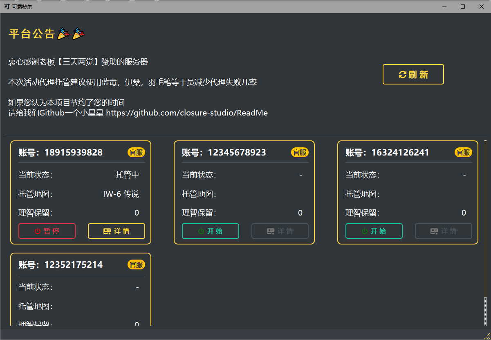
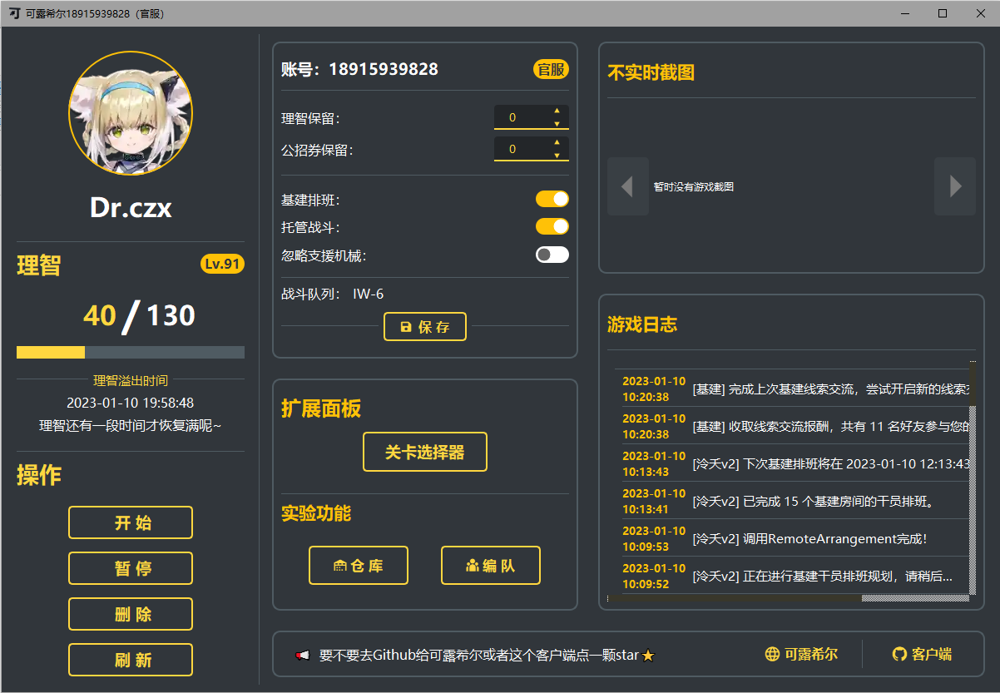

# Closure 小帮手

- 这是 可露希尔工作室 的Windows客户端（Linux， MacOS适配中）
- 可露希尔工作室 Github: https://github.com/closure-studio/ReadMe
- 网页端： https://arknights.host/
- 客户端基于 PyQt5 编写（可能考虑升级PyQt6）

### 有哪些功能呢：
- 登录账号
- 公告更新
- 停服维护支持
- 游戏账号管理
- 查看游戏数据
- 托管配置
- 不实时截图
- 托管配置

### TODO（可能不会DO）：
- 资源自动更新
- 注册账号
- 添加、删除游戏账号
- 滑动验证（Geetest暂不支持Python）
- 关卡选择器
- 仓库查看
- 一些漂亮的界面（永远的坑）

### 截图：

